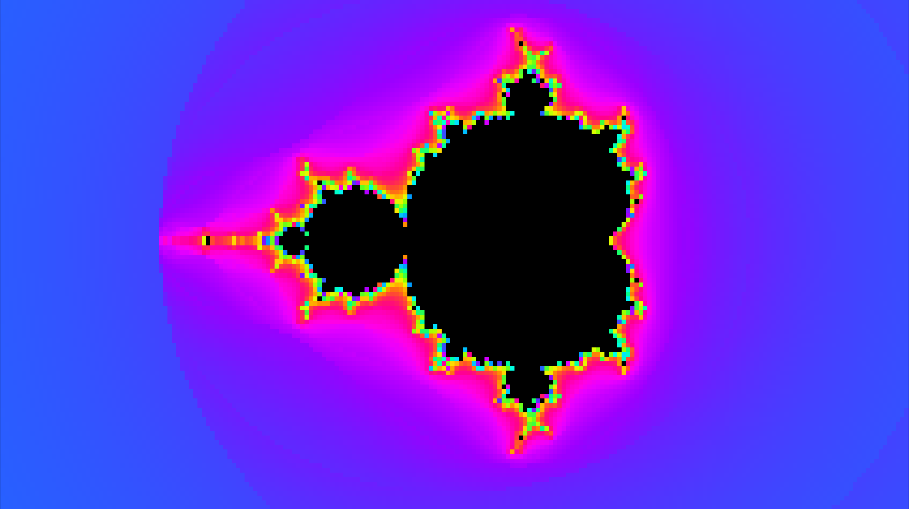
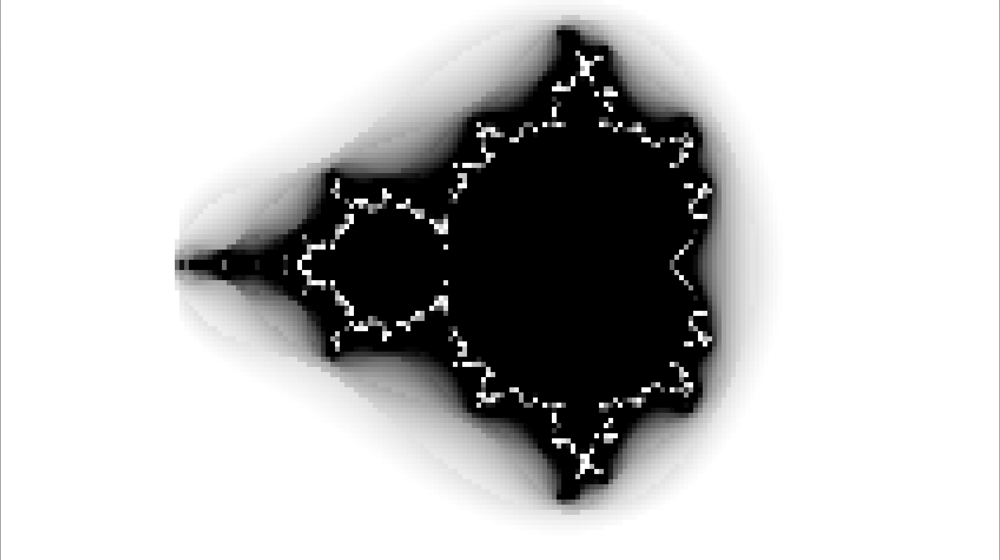
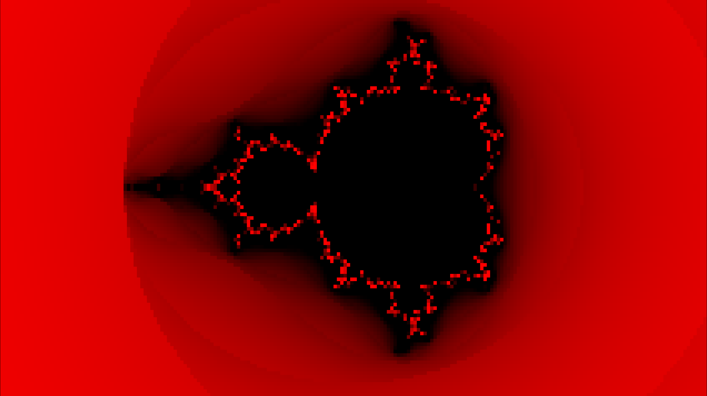
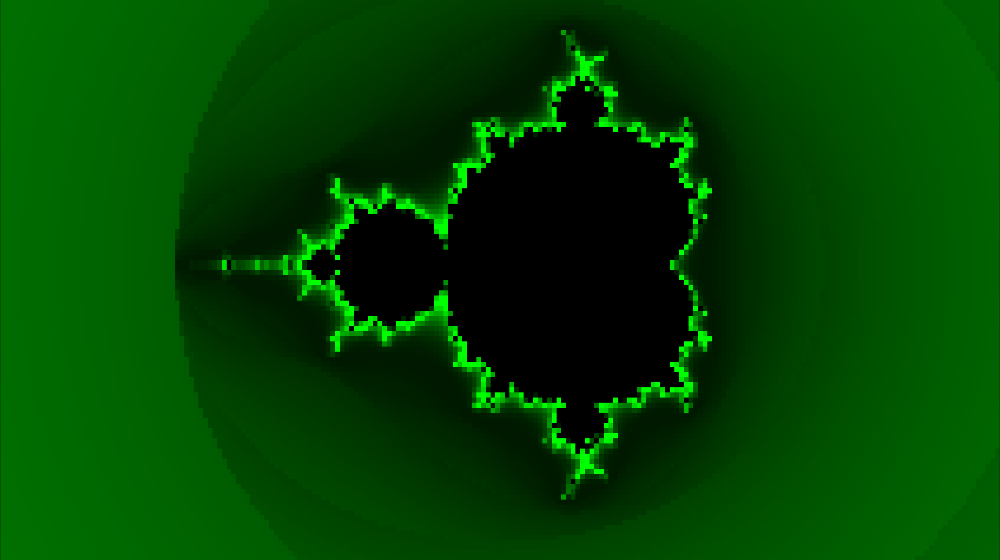
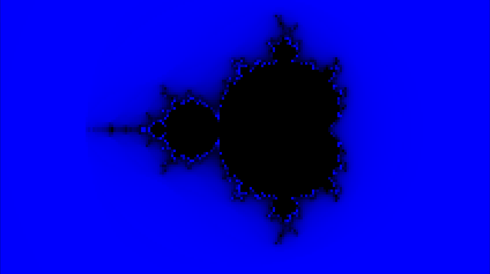
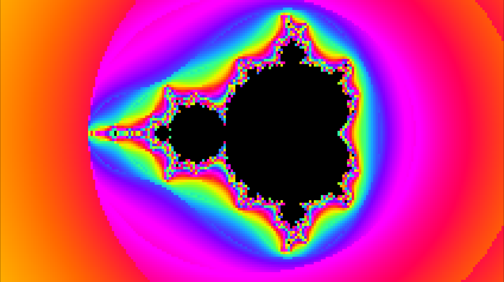
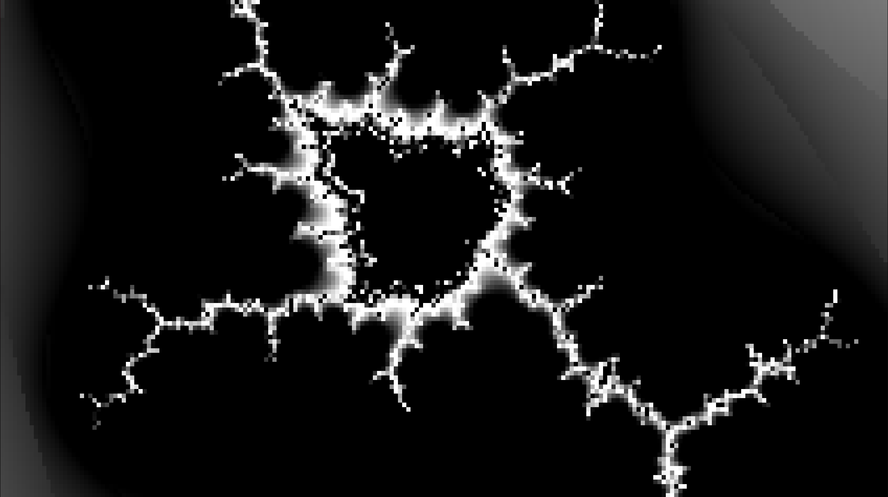
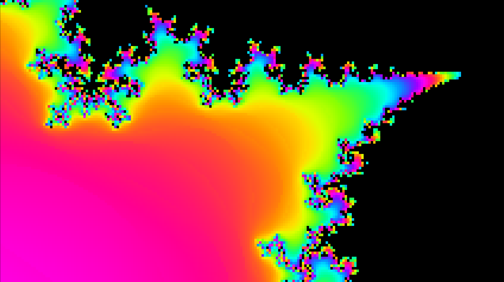
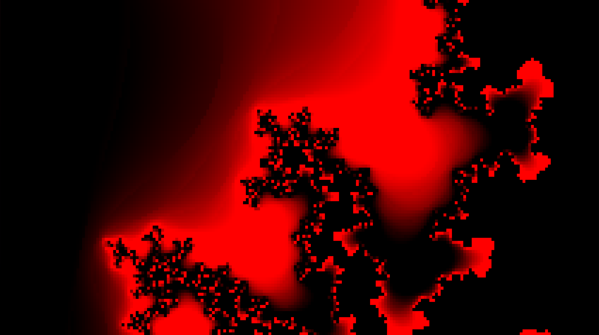
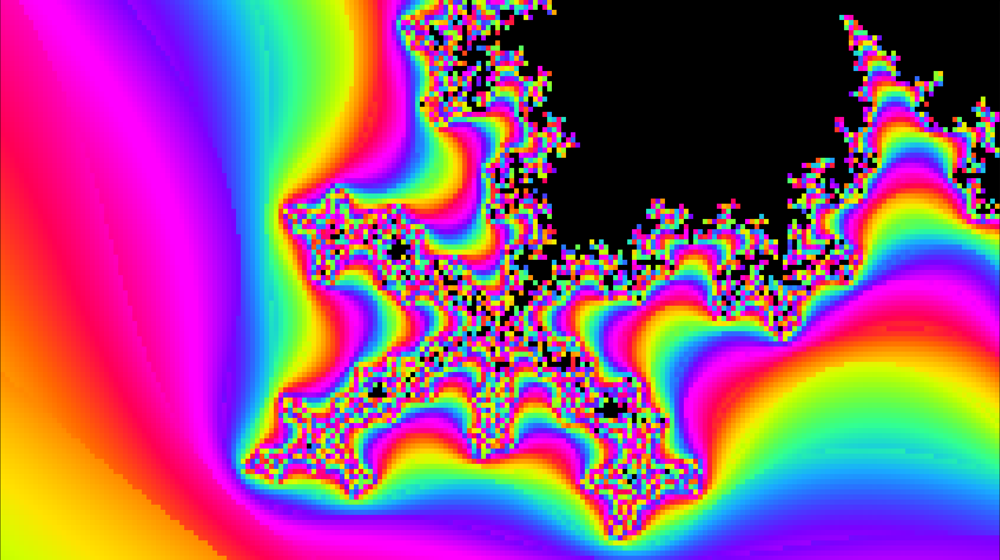

# About
The Mandelbrot set rendered in the terminal. Adjustable iteration depth calculation, color palettes, wiewing window, and full renders available to print to .ppm. 

The Mandelbrot set uses the equation:  $Z_{n+1} = Z_n^2 + c$, where $c$ is a complex number. The render takes place in the complex plane. Each $x$ and $y$ coordinate are the initial values for the real and imaginary components of $c$ respectively. This program allows you to zoom in dozens of times and starts to lose resolution around ~36 quadrillion zoom. This resolution is a limit of the ```long double``` precision (on x86-64 machines, that's ~18-21 decimal digits). Although (my cpu) gets pretty angered when asked to do that much work: so it's pretty impractical to explore at that depth. I'm considering multithreading to speed the process but until then, working on other things.

It basically has two parts, calculating how many iterations it took a point / pixel to "escape" and calculating the color of each pixel to make it look nice. I had a lot of fun with this project. Credit to Easton for the inspiration.

| Keybind | Function |
|:--:|:--|
| ```f``` | Zoom in |
| ```e``` | Zoom out |
| ```c``` | Increase iteration depth |
| ```x``` | Decrease iteration depth |
| ```w``` | Pan up |
| ```a``` | Pan left |
| ```s``` | Pan down |
| ```d``` | Pan right |
| ```r``` | Cycle pallete presets |
| ```p``` | Print to .ppm |
| ```i``` | Print info about present render |
| ```h``` | Returns to default window / home |
| ```q``` | Quit |
| ```1-3``` | Increase brightness for RGB respectively |
| ```!-#``` | Decrease brightness for RGB respectively |
| ```4-6``` | Increase contrast for RGB respectively |
| ```$-^``` | Decrease contrast for RGB respectively |
| ```7-9``` | Increase frequency for RGB respectively |
| ```&-(``` | Decrease frequency for RGB respectively |
| ```0-=``` | Increase hue shift for RGB resepctively |
| ```)-+``` | Decrease hue shift for RGB respectively |

As the input is through the terminal, you have to press ```enter``` to send your commands. You can buffer / stack commands, but it's still kind of annoying.

## Future Plans / Ideas
- The addition of Julia sets
- Multithreading / GPU computing
- Live input from the keyboard (eliminating the need to press ```enter```)
- Using bigger "data types" to render deeper
  - In practice, you'd really just make your own data type as a(n) array/vector/list
- Printing to something other than .ppm to reduce the insane amount of storage taken up by those files
- Adding a way to get terminal width / height at runtime, so you won't have to change those constexpr in common.h and rebuild

## Gallery












